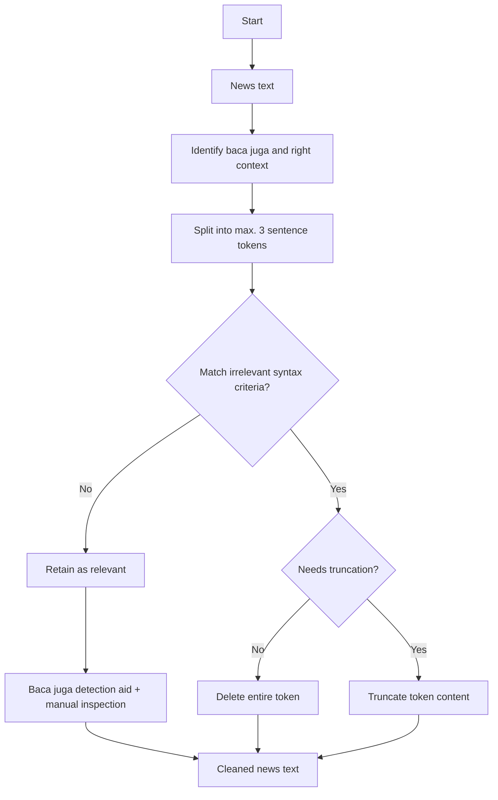

# baca-juga-cleaner
<p>
  
</p>
This program cleans news content text data by removing irrelevant syntactic constituents initiated by strings such as `"baca juga"` and `"advertisement"`, which are likely promotional, redundant, or non-informative.

**For example:**
> *BACA JUGA: Dapatkan Hadiah Uang Gratis Melalui DANA Kaget*

The cleaning pipeline is designed for **media monitoring** use cases, particularly to prepare datasets for **Share of Voice (SOV)** analysis in brand-related news coverage.

### Why it matters
In media monitoring, irrelevant constituents like "baca juga..." can distort keyword frequency related to monitored brands. These constituents are difficult to isolate because they can appear anywhere in the text, span beyond single clauses, and are often poorly punctuated. This tool applies rule-based logic and NLTK sentence tokenization to remove such syntactic noise and improve the accuracy of downstream tasks like Share of Voice (SOV) analysis.

The data-cleaning algorithm removes irrelevant constituents by filtering syntactic constructions associated with `"baca juga"` based on how they are typically constructed within news content. More on syntactic constructions of `"baca juga"` constituents can be found [here](baca_juga_syntax.md). More detailed analysis can be found [here](https://github.com/alanindra/baca-juga-cleaner/blob/main/analysis.ipynb).

## Getting started
Required libraries:
```
pip install pandas nltk tqdm
```
> [!NOTE]
> By default, the news text is stored in the 'content' column. To modify the column names, please update the 'config.json' file.

## Data cleaning flowchart


## Example uses
### Punctuated irrelevant syntactic constituent
**Uncleaned news content:**
> Berbelanja di aplikasi Shopee akan semakin nyaman dengan menggunakan voucher gratis ongkir, cashback hingga potongan diskon. Itulah sebabnya Anda harus mengetahui cara mendapatkan voucher Shopee gratis ongkir dan cashback, untuk belanja hemat. Voucher Shopee memiliki perbedaan sesuai fungsinya. Voucher gratis ongkir berfungsi untuk mendapatkan gratis ongkos kirim. Voucher cashback berfungsi untuk mendapatkan cashback berupa koin Shopee. Sedangkan voucher diskon berfungsi untuk mendapat potongan diskon. **BACA JUGA: Butuh Dana Cepat Rp5,5 Juta? Pahami Cara Pinjam Uang di Shopee Paylater dan Shopee Pinjam**. Ada 5 cara mendapatkan voucher Shopee gratis ongkir, cashback dan juga potongan diskon. Berikut cara mendapatkan sekaligus mengklaim voucher Shopee, yang dikutip dari halaman bantuan Shopee, help.shopee.co.id: 1. Klaim Voucher Shopee Voucher Shopee juga bisa diklaim dengan mudah untuk mendapatkan cashback koin hingga gratis ongkir di menu utama.

**Cleaned news content:**
> Berbelanja di aplikasi Shopee akan semakin nyaman dengan menggunakan voucher gratis ongkir, cashback hingga potongan diskon. Itulah sebabnya Anda harus mengetahui cara mendapatkan voucher Shopee gratis ongkir dan cashback, untuk belanja hemat. Voucher Shopee memiliki perbedaan sesuai fungsinya. Voucher gratis ongkir berfungsi untuk mendapatkan gratis ongkos kirim. Voucher cashback berfungsi untuk mendapatkan cashback berupa koin Shopee. Sedangkan voucher diskon berfungsi untuk mendapat potongan diskon. Ada 5 cara mendapatkan voucher Shopee gratis ongkir, cashback dan juga potongan diskon. Berikut cara mendapatkan sekaligus mengklaim voucher Shopee, yang dikutip dari halaman bantuan Shopee, help.shopee.co.id: 1. Klaim Voucher Shopee Voucher Shopee juga bisa diklaim dengan mudah untuk mendapatkan cashback koin hingga gratis ongkir di menu utama.

**Explanation:**  
The tool successfully removes the punctuated irrelevant constituent:  
> **BACA JUGA: Butuh Dana Cepat Rp5,5 Juta? Pahami Cara Pinjam Uang di Shopee Paylater dan Shopee Pinjam**

### Unpunctuated sequence of irrelevant syntactic constituent
**Uncleaned news content:**
> Aplikasi Pinjaman Terbaru Limit Hingga 5 Juta 2025, Dengan Tenor Panjang Bisa Untuk Dana Mudik Reporter: Alfin Ananda | Editor: Syamsul Falaq | Jumat 21-03-2025,04:05 WIB Aplikasi Pinjaman Terbaru Limit Hingga 5 Juta 2025, Dengan Tenor Panjang Bisa Untuk Dana Mudik-- SPinjam adalah pinjaman-online web langsung cair yang dikelola oleh Shopee terdaftar dan diawasi oleh OJK, pinjol ini memiliki keunggulan unik yang tidak dimiliki pinjol lainnya, salah satunya adalah pencairan ke ShopeePay atau Seabank, bank digital yang dikelola oleh Sea Group. **BACA JUGA : Aplikasi Pinjol Daring Tercepat Terdaftar OJK Limit Hingga 30 Juta, Cepat Cair Bunga Rendah Dan Tenor Panjang BACA JUGA : Kebutuhan Lebaran Mencapai 80 Juta? Simak Aplikasi Pinjol Langsung Cair, Anti Ditolak Resmi OJK Berikut** 5.Kredivo Kredivo hadir sebagai alternatif pinjaman yang patut dipertimbangkan dengan status terdaftar dan diawasi oleh OJK, keunggulan Kredivo terletak pada variasi produk pinjaman yang ditawarkan, memungkinkan nasabah untuk memilih opsi yang paling sesuai dengan kebutuhan finansial mereka. Salah satu fitur yang menonjol dari Kredivo adalah persyaratan minimal penghasilan yang relatif terjangkau, yaitu hanya Rp3 juta per bulan, membuka akses pembiayaan bagi segmen masyarakat yang lebih luas.

**Cleaned news content:**
> Aplikasi Pinjaman Terbaru Limit Hingga 5 Juta 2025, Dengan Tenor Panjang Bisa Untuk Dana Mudik Reporter: Alfin Ananda | Editor: Syamsul Falaq | Jumat 21-03-2025,04:05 WIB Aplikasi Pinjaman Terbaru Limit Hingga 5 Juta 2025, Dengan Tenor Panjang Bisa Untuk Dana Mudik-- SPinjam adalah pinjaman-online web langsung cair yang dikelola oleh Shopee terdaftar dan diawasi oleh OJK, pinjol ini memiliki keunggulan unik yang tidak dimiliki pinjol lainnya, salah satunya adalah pencairan ke ShopeePay atau Seabank, bank digital yang dikelola oleh Sea Group. 5.Kredivo Kredivo hadir sebagai alternatif pinjaman yang patut dipertimbangkan dengan status terdaftar dan diawasi oleh OJK, keunggulan Kredivo terletak pada variasi produk pinjaman yang ditawarkan, memungkinkan nasabah untuk memilih opsi yang paling sesuai dengan kebutuhan finansial mereka. Salah satu fitur yang menonjol dari Kredivo adalah persyaratan minimal penghasilan yang relatif terjangkau, yaitu hanya Rp3 juta per bulan, membuka akses pembiayaan bagi segmen masyarakat yang lebih luas.

**Explanation:**  
The tool detects and removes a long unpunctuated sequence of irrelevant constituents:
> **BACA JUGA : Aplikasi Pinjol Daring Tercepat Terdaftar OJK Limit Hingga 30 Juta, Cepat Cair Bunga Rendah Dan Tenor Panjang BACA JUGA : Kebutuhan Lebaran Mencapai 80 Juta? Simak Aplikasi Pinjol Langsung Cair, Anti Ditolak Resmi OJK Berikut**
