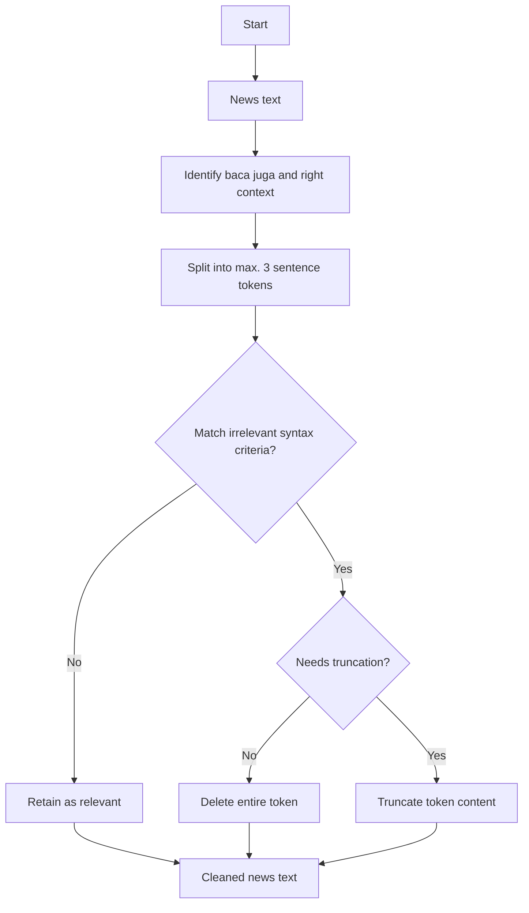

# baca-juga-cleaner
This program cleans news content text data by removing irrelevant syntactic constituents initiated by strings such as `"baca juga"` and `"advertisement"`, which are likely promotional, redundant, or non-informative.

**For example:**
> *BACA JUGA: Dapatkan Hadiah Uang Gratis Melalui DANA Kaget*

The cleaning pipeline is designed for **media monitoring** use cases, particularly to prepare datasets for **Share of Voice (SOV)** analysis in brand-related news coverage.

### Why it matters
In media monitoring, irrelevant constituents like "baca juga..." can distort keyword frequency related to monitored brands. These constituents are difficult to isolate because they can appear anywhere in the text, span beyond single clauses, and are often poorly punctuated. This tool applies rule-based logic and NLTK sentence tokenization to remove such syntactic noise and improve the accuracy of downstream tasks like Share of Voice (SOV) analysis.

The data-cleaning algorithm removes irrelevant constituents by filtering syntactic constructions associated with `"baca juga"` based on how they are typically constructed within news content. More on syntactic constructions of `"baca juga"` constituents can be found [here](baca_juga_syntax.md). More detailed analysis can be found [here](https://github.com/alanindra/baca-juga-cleaner/blob/main/analysis.ipynb).

## Getting started
Required libraries:
```
pip install pandas
pip install nltk
```

## Data cleaning flowchart


## Example uses:
### Punctuated irrelevant syntactic constituents
Uncleaned news content:
> Berbelanja di aplikasi Shopee akan semakin nyaman dengan menggunakan voucher gratis ongkir, cashback hingga potongan diskon. Itulah sebabnya Anda harus mengetahui cara mendapatkan voucher Shopee gratis ongkir dan cashback, untuk belanja hemat. Voucher Shopee memiliki perbedaan sesuai fungsinya. Voucher gratis ongkir berfungsi untuk mendapatkan gratis ongkos kirim. Voucher cashback berfungsi untuk mendapatkan cashback berupa koin shopee. Sedangkan voucher diskon berfungsi untuk mendapat potongan diskon. **BACA JUGA: Butuh Dana Cepat Rp5,5 Juta? Pahami Cara Pinjam Uang di Shopee Paylater dan Shopee Pinjam**. Ada 5 cara mendapatkan voucher Shopee gratis ongkir, cashback dan juga potongan diskon. Berikut cara mendapatkan sekaligus mengklaim voucher Shopee, yang dikutip dari halaman bantuan Shopee, help.shopee.co.id: 1. Klaim Voucher Shopee Voucher Shopee juga bisa diklaim dengan mudah untuk mendapatkan cashback koin hingga gratis ongkir di menu utama.

Cleaned news content:

> Berbelanja di aplikasi Shopee akan semakin nyaman dengan menggunakan voucher gratis ongkir, cashback hingga potongan diskon. Itulah sebabnya Anda harus mengetahui cara mendapatkan voucher Shopee gratis ongkir dan cashback, untuk belanja hemat. Voucher Shopee memiliki perbedaan sesuai fungsinya. Voucher gratis ongkir berfungsi untuk mendapatkan gratis ongkos kirim. Voucher cashback berfungsi untuk mendapatkan cashback berupa koin shopee. Sedangkan voucher diskon berfungsi untuk mendapat potongan diskon. Ada 5 cara mendapatkan voucher Shopee gratis ongkir, cashback dan juga potongan diskon. Berikut cara mendapatkan sekaligus mengklaim voucher Shopee, yang dikutip dari halaman bantuan Shopee, help.shopee.co.id: 1. Klaim Voucher Shopee Voucher Shopee juga bisa diklaim dengan mudah untuk mendapatkan cashback koin hingga gratis ongkir di menu utama.

It removes the promotional/advertising "**BACA JUGA: Butuh Dana Cepat Rp5,5 Juta? Pahami Cara Pinjam Uang di Shopee Paylater dan Shopee Pinjam**" phrase mentioning the brand DANA from news mentioning the brand Shopee.

### Unpunctuated irrelevant syntactic consituents
Uncleaned news content:
> lorem ipsum

Cleaned news content:
> lorem ipsum

### Sequences of irrelevant syntactic consituents, where some consituents are not initiated by "baca juga" string
Uncleaned news content:
> lorem ipsum

Cleaned news content:
> lorem ipsum

